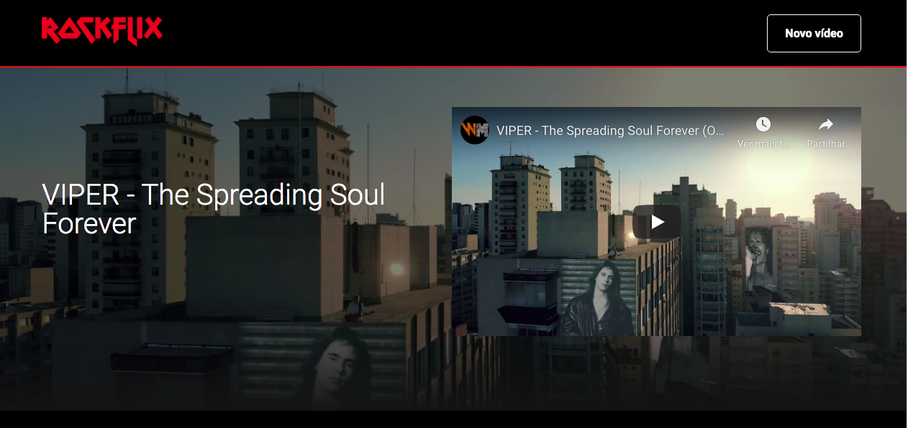
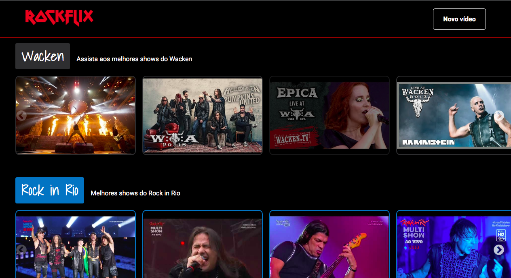

# Imersão React - Aluraflix

## Instrutores

* ### Mario Souto 
  *Instrutor da Alura, engenheiro Nubank*

* ### Juliana Negreiros 
  *Coordenadora dos cursos de front-end da Alura*

* ### Marco Bruno 
  *Engenheiro de software na Suécia*

### Resumo do Projeto:

O projeto consiste em desenvolver uma aplicação web reproduzindo a interface da Netflix, podendo colocar uma lista de videos favoritos. Criei assim a Rockflix com os meus videos favoritos de festivais.

1 - Iniciando o projeto usando o Create React App, criando vários componentes e fazendo a publicação da aplicação usando Vercel.

2 - A aplicação será SPA. Criado um template com cabeçalho e rodapé e um carrossel para mostrar os videos.

3 - Responsivo, para versão mobile.

4 - Trabalhar com elementos dinâmicos na tela da aplicação.

5 - Construído um servidor e adicionado um banco de dados local.

6 - Adicionando a funcionalidade de cadastrar nos vídeos e home dinâmica.

7 - Na versão mobile o vídeo do banner aparece em outra rota.

### Recursos:

 * ReactJS, React Route, React Slick
 * Styled Components
 * JavaScript
 * Eslint
 * JSON Server (Heroku) 

    

 *criado por Elisa Andrade

 